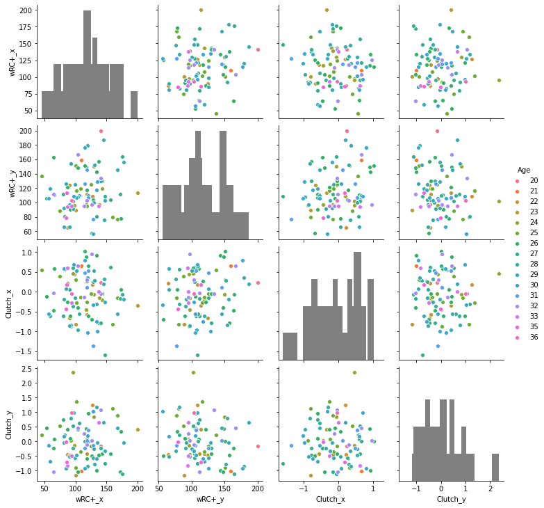
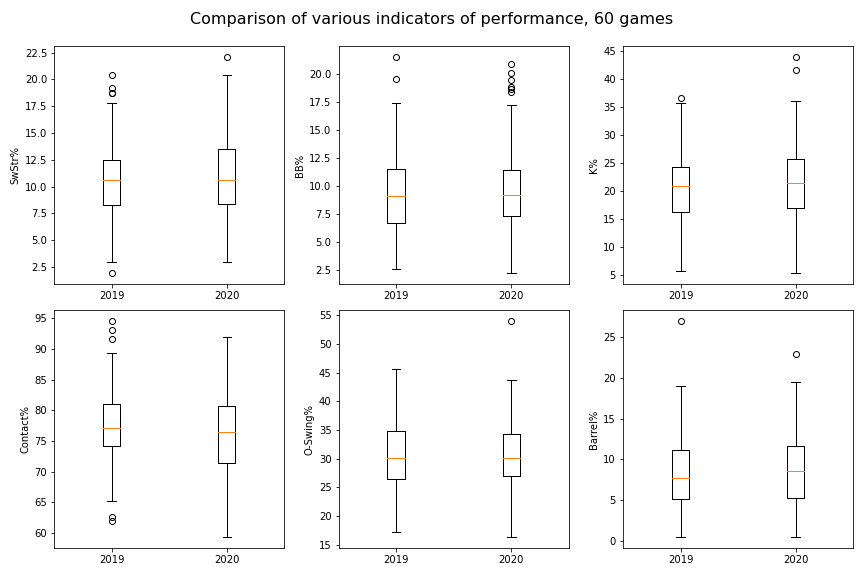
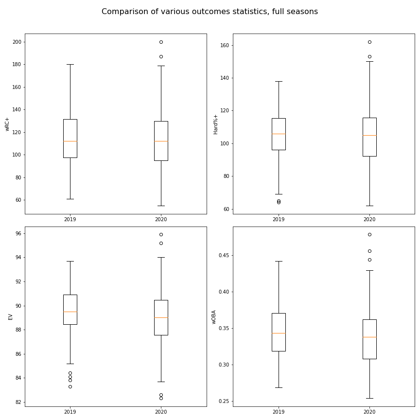
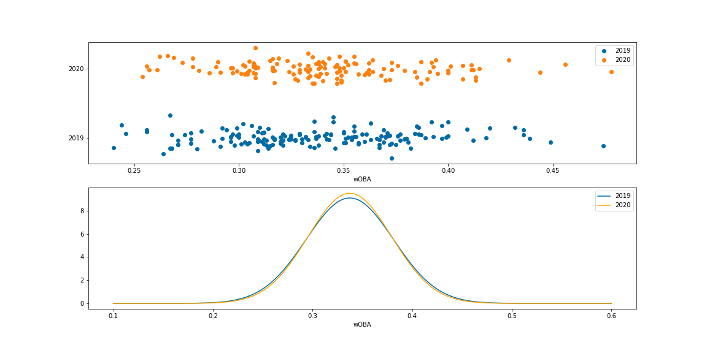
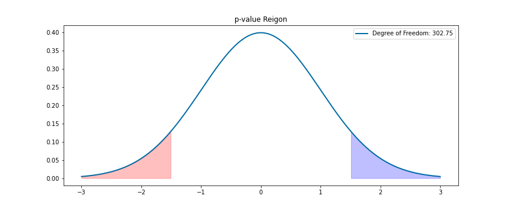

# Examining the Potential Impact of Rule Changes and New Protocols on Player Performance in the 2020 MLB Season

I am a lifelong baseball fan using my data analysis skills to determine whether the rule changes and other adjustments made by Major League Baseball had a significant effect on any performance metrics or statistics for the 2020 MLB season. Here, I compare the shortened 2020 60 game season with the first 60 games of the 2019 season, but in the future I will continue to expand upon this analysis to uncover any possible changes that may have been brought on by the 2020 season.

## Data Sources

1. Used Fangraphs to get player statistics for the 2019 and 2020 season. [Example](https://www.fangraphs.com/leaders.aspx?pos=all&stats=bat&lg=all&qual=0&type=8&season=2020&month=0&season1=2020&ind=0&team=0,ts&rost=&age=&filter=&players=0)
2. Used Baseball Reference to get game by game logs for individual players. Not used in this analysis, but will be used in future studies. [Example](https://www.baseball-reference.com/players/gl.fcgi?id=bettsmo01&t=b&year=2020)

## Background Information

* A typical baseball season is 162 games with around 30 pre-season games immediately before the regular season
* Due to the COVID-19 pandemic, the 2020 season was only 60 games, and the pre-season was interrupted and heavily shortened
* In addition, Major League Baseball instituted various rule changes, that could presumably impact player performance in unforseen ways
* These changes included but were not limited to:
    * Instituting a Designated Hitter in the National League (previously only in the American League)
    * Requiring relief pitchers to face at least 3 batters or finish an inning before exiting a game
    * Starting all extra innings after the ninth inning with a runner on 2nd
    * Shortening both games of doubleheaders to 7 innings
    * Not allowing any fans to attend games
* These changes, as well as the many other changes in protocols and requirements could certainly impact player performance, but it is difficult to say exactly whether the net effect would be positive or negative

## Exploratory Data Analysis

In order to get an idea for how performance may have been impacted by all of these adjustments, I isolated the first 60 games of the 2019 season, so that it would be a more direct comparison to the 2020 season. I then filtered both the 2019 and 2020 datasets down to only players who had a qualifying number of plate appearances in both seasons (meaning they had at least 60 plate appearances in both 2019 and 2020). 

I then performed EDA on these datasets in order to see if there were any obvious differences in performance or statistical outcomes that stuck out. I first started with a pair plot grouped by age to see if any interesting trends or correlations might be observed:

This did not yield any obvious directions for my explorations, so I constructed boxplots to see if there were any clear differences in indicators of performance between the two seasons:

Since I could not detect any glaring discrepancies in these indicators, I then isolated various outcomes statistics and made boxplots with those:

I again could not find any clear measures that reflected a difference between the 2019 and 2020 season.

## Hypothesis Testing and t-test

In order to more conclusively say whether or not a significant difference could be detected, I conducted a Null Hypothesis Statistical Test, and used t-tests to determine whether there was a statistically significant difference in any of the above statistics or indicators. I used a two-tailed hypothesis test, as I was not sure whether the overall impact would increase or decrease player performance

\\[ H_0: \text{There was no difference in player performance metrics or outcomes statistics between the 2019 and 2020 MLB seasons} \\]

\\[ H_A: \text{There was a difference in player performance metrics or outcomes statistics between the 2019 and 2020 MLB seasons, because of rule changes and other adjustments} \\]

$$\alpha: 0.1$$

The following is one example of many showing how I first examined a more granular visulization of the data before conducting a Welch's t-test. The example shown below uses Weighted On Base Average (wOBA), which is a cover-all statistic to roughly evaluate a players offensive value per plate appearance.

I then calculated the degrees of freedom just to get an idea of what the rejection region would look like:

In the above case, the high degrees of freedom means the ability to reject the null will be higher, however, the p-value still did not go below the rejection threshold:

$$t-statistic: -0.682$$
$$p-value: 0.496$$

Thus, we fail to reject the null. All subsequent analyses also failed to reject the null.

## Conclusions

Based on my analysis thus far, it could not be determined that there was any significant difference in performance between the 2019 and 2020 seasons, and thus it cannot be stated that the rules or protocol changed had any impact on performance.
* It is possible that the individual changes did have isolated impacts, but that these changes were washed out by each other
* It is also possible that these players are professional athletes, and are still just as good at their jobs no matter what the playing conditions are

## Future Directions

* Examine potential effect of the absence of fans by looking for differences between Home and Away performance the past two seasons
* Examine the potential effect of the DH in the National League by separating the datasets by League
* Find a good dataset of umpire data in order to determine whether absence of fans allowed umpires to be less biased towards home teams
* Find a good dataset of injury data to see whether prevalence, frequency or severity of certain injuries was higher or lower this season
